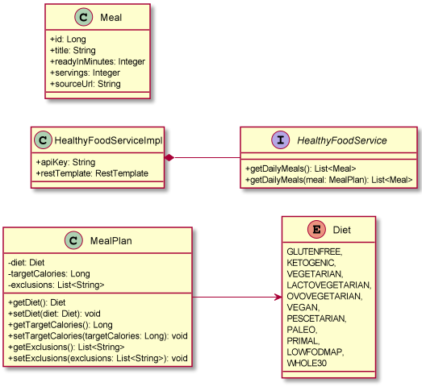

# 🥗 Healthy Food API

# Introduction

This is a daily meal planning API that makes use of the [Spoonacular API](https://spoonacular.com/food-api) 
to get a meal plan for a single day based on calories and dietary requirements.

## Approach

### Diagram 

Developed a diagram as a starting point to define processes.

Generated Spring Boot project called `Healthy Food API`

Used Spring  `Initializr`, metadata included: maven, Java 17

Dependencies used:
- Spring Web - web endpoint for clients - (rather than Spring reactive web)
- Validation - to simplify validation of parameters
- Java Actuator - Actuator is mainly used to expose operational information about the running application — health, metrics, info, dump, env, etc
  
  http://localhost:8080/actuator/health

  http://localhost:8080/actuator/info
- Test - easier to write tests

The following classes were created:
`Enum class Diet` - GLUTENFREE KETOGENIC VEGETARIAN LACTOVEGETARIAN OVOVEGETARIAN VEGAN PESCETARIAN
PALEO PRIMAL LOWFODMAP WHOLE30
`MealPlan Class` - 
`HealthyFoodService Implementation class` - 
`HealthyFood Service class` -
`Meal Class` - 

### Project Structure

The API structure has a `src`, a `test` and `main`. 
This application is a Spring Boot application, that is part of the Spring Boot ecosystem. 
It is a framework we can use to quickly start to build a web application using Java.

### How to use it:

To run this API you need to watch out for the `@SpringBootApplication` annotation which 
tells the Spring framework that this specific class is the main entry point. 
The annotation is in the `HealthyFoodApplication` main class in the `healthyfood` 
package. Run the application.

In a browser, go to `localhost:8080/api/v1/mealplanner` and you can see the API 
filtering by diet and/or by calories:
- filters a specific diet and eventually max calories, if specified 
i.e. http://localhost:8080/api/v1/mealPlanner/diet=PALEO/2000

- DIETS ALLOWED : ANY DIET FROM Enum class Diet

- It is possible to specify any food to `exclude`, just separate them with a `,` if they have more 
than a single ingredient. Optionally it is possible to specify a max number of calories too.
i.e. http://localhost:8080/api/v1/mealPlanner/exclude=sugar,fruit,chicken,eggs,cheese/1100

### Extensions

Deploy your API onto a cloud service, such as AWS.

